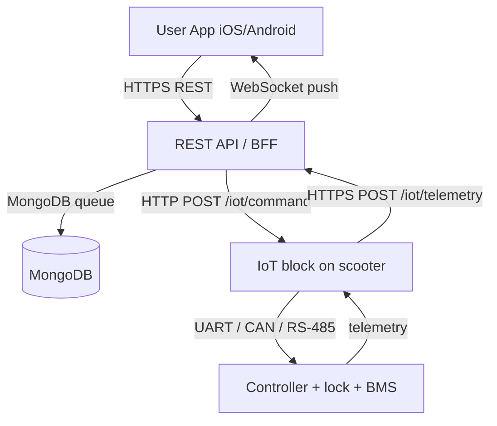

# Virent — Scooter Sharing Platform

> Three Design Systems: Frontend v2.0 «Интуитивная плотность» + Backend v1.0 «Чистая библиотека» + Database v1.0 «Чистое хранилище»

## Architecture

Four runtime components. The admin website and the user website are removed — all admin functions live in the Windows desktop app, all user functions live in the iOS / Android apps. Only two places can produce a runtime error: the Windows app and the REST API.

```text
virent/
├── backend/          # REST API (Node.js + Express + MongoDB)
│   ├── src/modules/  # 19 domain modules (Clean Architecture)
│   ├── src/views/    # View API / BFF (request tree executor)
│   ├── src/shared/   # errors, logger, db, cache, validation, metrics, permissions
│   ├── src/realtime/ # WebSocket server for live updates
│   ├── src/contracts/# OpenAPI spec
│   └── db/           # migrations + access patterns (YAML)
├── mobile/           # Expo React Native (iOS + Android, single codebase)
├── desktop-app/      # Windows app — installer + admin (C++20 / Win32)
├── infra/            # nginx, mosquitto, backups
├── docs/             # Constitution (3 design systems) + CHANGELOG
└── docker-compose.yml
```

| Component | Role | Stack |
|-----------|------|-------|
| iOS app (`mobile/`) | End-user client: find, rent, pay, support | React Native + Expo |
| Android app (`mobile/`) | End-user client: find, rent, pay, support | React Native + Expo |
| Windows desktop app (`desktop-app/`) | Server installer + all admin functions | C++20 + Win32 API |
| REST API (`backend/`) | Backend for all clients | Node.js + MongoDB |

Removed from the stack: `frontend/admin-dashboard`, `frontend/webb-client`.

## Three Design Systems

### 1. Frontend Design System v2.0 — «Интуитивная плотность»

- P0–P3 priorities: critical → frequent → additional → rare
- 8 px grid: spacing scale, typography scale, color system (neutral + primary + semantic)
- 100 UX laws: from screen physics to WCAG AA
- Components: button, input, table, card, modal, toast
- 7-step design algorithm: wireframe → test

### 2. Backend Design System v1.0 — «Чистая библиотека»

- Modular Monolith + Clean / Hexagonal Architecture
- CQRS-lite: commands (write) separated from queries (read)
- BFF / View API: one endpoint per screen, 15 requests → 1
- B0–B3 data priorities: critical → frequent → additional → heavy
- Resource budgets: P95 latency, max payload, max DB queries per request

### 3. Database Design System v1.0 — «Чистое хранилище»

- Access-pattern-first: tables from domain, indexes from queries
- D0–D3 priorities: critical → frequent → additional → archive
- Naming: `idx_{table}_{columns}`, `uniq_{table}_{meaning}`, snake_case
- Optimistic locking: `version` column on every model
- Soft delete: `deleted_at` on every model
- Outbox pattern: `outbox_events` for reliable events

## Scooter <-> Software Communication

The full chain, layer by layer, with the protocol at each hop:



Step by step (verified end-to-end):

1. User scans QR or selects a scooter in the app.
2. App sends `POST /v1/trips/reserve` to the API.
3. API checks balance, rights, geofence, scooter status.
4. API queues a command via `POST /v1/iot/command/send` (status `pending`).
5. Scooter's IoT block polls `GET /v1/iot/command?mac=...` every few seconds.
6. Scooter receives `unlock`, drives the controller over UART, opens the lock, enables the motor.
7. During the ride the IoT block pushes `POST /v1/iot/telemetry` with GPS, speed, battery, status.
8. On events (fall, geofence breach, low battery) it pushes `POST /v1/iot/event`.
9. On trip end, the API queues `lock`; the scooter disables the motor and locks.

Verified commands: `lock`, `unlock`, `alarm_on`, `alarm_off`, `led_on`, `led_off`, `update_firmware`, `reboot`, `locate`.

## Quick start

```bash
# Backend stack (MongoDB + REST API + mosquitto + nginx)
bash scripts/start-sparkrentals.sh --seed

# REST API:     http://localhost:8393/v1/
# Health:       http://localhost:8393/health
# Metrics:      http://localhost:8393/metrics

# Windows desktop app (on Windows)
cd desktop-app
mkdir build && cd build
cmake .. -G "Visual Studio 17 2022" -A x64
cmake --build . --config Release
./Release/VirentControlCenter.exe

# Mobile apps (iOS / Android)
cd mobile
eas build --platform ios
eas build --platform android
```

Default logins (after `--seed`):

```text
Admin:  admin@sparkrentals.local / Admin123!
User:   user@sparkrentals.local  / User123!
```

## API

Base path: `/v1`

```text
# Auth
POST   /v1/auth/login/server/admin         # Admin login (email + password)
POST   /v1/auth/login/server/user          # User login (email + password)
POST   /v1/auth/refresh                    # Rotate access token
POST   /v1/auth_ext/phone/send-code        # Send OTP via SMS
POST   /v1/auth_ext/phone/login            # Verify OTP, return token

# Trips
POST   /v1/trips/reserve                   # Reserve a scooter (10 min TTL)
POST   /v1/trips/start                     # Start the ride
POST   /v1/trips/end                       # End the ride, calculate cost
POST   /v1/trips/cancel                    # Cancel reservation / ride
GET    /v1/trips/active                    # Active trip for current user
GET    /v1/trips/history                   # Past trips (cursor pagination)

# Scooters
GET    /v1/scooters                        # List scooters
GET    /v1/scooters/:id                    # Scooter detail
POST   /v1/scooters                        # Register scooter (admin)
PUT    /v1/scooters/status                 # Update status
PUT    /v1/scooters/coordinates            # Update GPS

# IoT (scooter <-> server)
POST   /v1/iot/telemetry                   # Scooter pushes GPS + battery
POST   /v1/iot/event                       # Scooter pushes event (fall, alarm)
GET    /v1/iot/command                     # Scooter polls for pending commands
POST   /v1/iot/command/send                # Admin queues a command

# View API (BFF — one call per screen)
GET    /v1/views/dashboard                 # Admin dashboard (3 sections, cached)
GET    /v1/views/trip-detail/:id           # Trip detail (4 sections)

# Admin
GET    /v1/users                           # List users
GET    /v1/cities                          # List cities
GET    /v1/prepaids                        # List prepaid cards
GET    /v1/audit-log                       # Append-only audit log
GET    /v1/stats                           # Aggregated stats
GET    /v1/support/admin/list              # Support tickets
```

## Windows desktop app — admin tabs (1:1 with former admin website)

16 sidebar tabs. Each admin tab is a native Win32 ListView (report mode, full-row select, gridlines) with a per-tab search box, refresh button, and Add / Export CSV actions. Data is fetched from the API and cached for 30 s.

```text
Tab           Columns
------------  ------------------------------------------------------------
Dashboard     Fleet stats + container status + endpoint list
Server        Docker: start/stop/restart/rebuild, logs, backup
Scooters      Name, Model, Status, Battery, MAC, Last seen
Trips         Trip ID, User, Scooter, Start, End, Distance, Cost, Status
Customers     Name, Email, Phone, Balance, Status, Trips, Joined
Cities        City, Scooters, Active, Rate start, Rate min, Tax %, Zones
Zones         City, Zone name, Type, Speed limit, Points
Map           (native — integrate Mapbox GL or Bing Maps)
Analytics     KPI cards + raw Prometheus metrics dump
AuditLog      Timestamp, Actor, Action, Entity, IP, Details
Prepaid       Code, Amount, Currency, Status, Used by, Expires
Juicers       Name, Phone, Status, Earnings, Tasks done, Rating
IoT Control   Lock / Unlock / Alarm / Reboot command buttons
Support       Ticket ID, Subject, User, Status, Priority, Created, Last reply
Settings      Install path, API URL, version, Docker status
Logs          Per-container Docker logs viewer
```

Icons: Segoe MDL2 Assets (Windows 10+ built-in icon font). No emoji anywhere in the UI.

## Mobile apps — screens

```text
Tab           Screen
------------  ------------------------------------
Map           MapPlaceholder (scooter discovery)
Trips         TripsList -> TripDetail
Wallet        Wallet (balance, top-up, promo)
Notifications NotificationsScreen
Settings      SettingsScreen

Stack         TripDetail, Support, Account
```

Icons: `@expo/vector-icons` (Ionicons). No emoji anywhere in the UI.

## Design tokens

Backend tokens live in `backend/src/shared/`. Frontend tokens live in `mobile/styles/tokens.ts` and `desktop-app/src/ui/theme.h`.

```text
Spacing:   4 8 12 16 24 32 48 64 96 128      (8px grid)
Typography: 11 12 14 16 20 28 40             (Inter / Segoe UI)
Colors:    neutral-50..950, primary-500..800, semantic: success warning danger info
Radius:    0 4 6 8 12 16 999                 (sm -> full)
Shadows:   xs sm md lg xl                    (only for floating elements)
Motion:    150ms / 200ms / 300ms             (fast / normal / slow, ease-out)
```

## Tests (75 passing)

```text
Trip entity         13   domain rules, cost calculation, state machine
Auth entity         15   User, TokenPair, OtpCode
Scooter entity      11   state machine
Validation          21   input validation
Trip controller      9   DTO + HTTP response format contracts
TOTP                 6   RFC 6238 compliance
Trip repository      9   MongoDB integration
```

## Security

- 2FA TOTP for admins
- Rate limiting: 4 limiters (global, auth, OTP, mutations)
- Helmet security headers
- Input validation on every endpoint
- MongoDB sanitize (NoSQL injection protection)
- bcrypt password hashing
- JWT rotation (access 15 min + refresh 30 d)

## License

MIT — see `LICENSE` per component.
